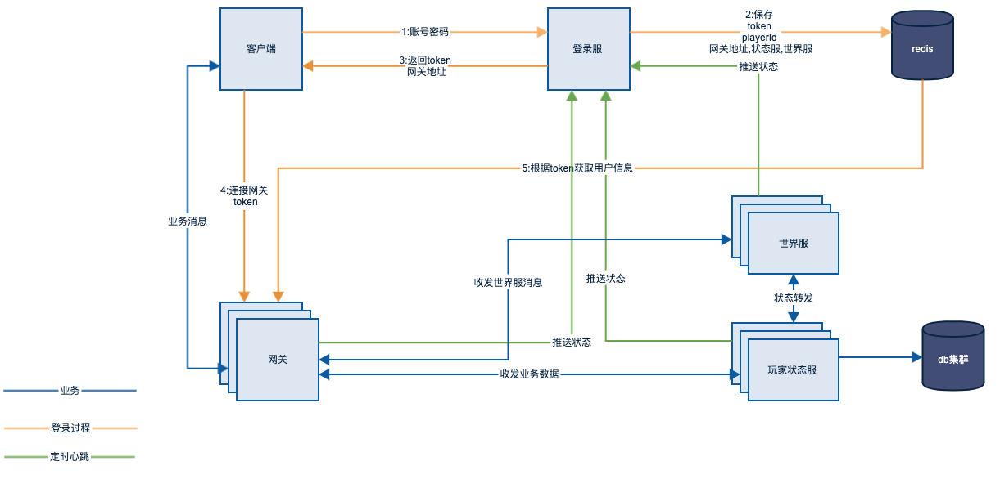

## 概览

## 游戏流程
1. 玩家首先登陆服进行验证
2. 验证成功获得网关服地址，token，并为玩家分配app服，世界服。世界服是玩家所在服务器id
3. 玩家带token连接网关服
4. 网关服进行认证，成功记录玩家的连接，失败则断开连接

## 消息协议
protobuf

## protobuf 生成命令
protoc --java_out=../ ./*.proto 

## game-base
游戏公共库

## game-login
http服务器
1. 游戏登陆服
2. 接收各类服务器状态信息推送
3. 给玩家分配app服，世界服

## game-world
一个服务器内，需要多个玩家互动的数据在这里同步
如聊天信息，要发到对应的世界服
一个世界服对一个服务
如 
s1 : game-world-1
s2 : game-world-2

这里的s1，s2是真正看到的服，如果s1，s2 和服成s1
这样s1，s2 是一个game-world
每个用户保存
第一次创建的服务器id，当前服务器id

## game-app
玩家的单机数据，各个服务器的玩家可以在一个game-app内

## game-gateway
### 功能
1. 消息转发 
- 根据玩家状态转发消息到对应的服务器，如用户获得金币走game-app，聊天信息走game-world

2. 消息限流

## game-client
游戏测试客户端

## game-tools
游戏工具开发项目
1. excel转json

## game-config
http服务器
游戏配置中心, 配置版本管理
可做成单点，因为只有在游戏服务器启动的时候才会用到

## 一些实现上的Tips
1. 登录登出接口特殊处理
2. 广播消息，如果tcpserver是内部服，则channel可能就是一个,把需要广播的消息发送到gateway在进行广播
3. Game做为全局游戏访问对象
4. 错误使用 ErrorEnum
5. 配置为app.yaml, app-{profile}.yaml格式。 app.yaml 默认会加载
6. message.proto 中起名要按要求起

### 设计问题：

